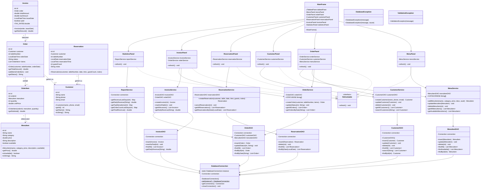

# UML-Klassendiagramm – Restaurant Management System

```mermaid
classDiagram
    %% ===== MODEL-KLASSEN =====
    class Customer {
        -int id
        -String name
        -String phone
        -String email
        +Customer(name, phone, email)
        +getId() int
        +getName() String
        +toString() String
    }

    class MenuItem {
        -int id
        -String name
        -String category
        -double price
        -String description
        -boolean available
        +MenuItem(name, category, price, description, available)
        +getPrice() double
        +isAvailable() boolean
        +toString() String
    }

    class Order {
        -int id
        -Customer customer
        -int tableNumber
        -LocalDateTime orderDate
        -String status
        -List~OrderItem~ items
        +Order(customer, tableNumber, orderDate)
        +getTotalAmount() double
        +addItem(OrderItem) void
        +getStatus() String
    }

    class OrderItem {
        -int id
        -int orderId
        -MenuItem menuItem
        -int quantity
        -double unitPrice
        +OrderItem(orderId, menuItem, quantity)
        +getSubtotal() double
    }

    class Reservation {
        -int id
        -Customer customer
        -int tableNumber
        -LocalDate reservationDate
        -LocalTime reservationTime
        -int guestCount
        -String notes
        +Reservation(customer, tableNumber, date, time, guestCount, notes)
    }

    class Invoice {
        -int id
        -Order order
        -double totalAmount
        -double taxAmount
        -LocalDateTime issueDate
        -boolean paid
        +Invoice(order, issueDate)
        +getNetAmount() double
        +TAX_RATE$ double
    }

    %% ===== BEZIEHUNGEN =====
    Order "1" --> "0..1" Customer : gehört zu
    Order "1" --> "1..*" OrderItem : enthält
    OrderItem "1" --> "1" MenuItem : referenziert
    Reservation "1" --> "0..1" Customer : gehört zu
    Invoice "1" --> "1" Order : fakturiert

    %% ===== DAO-KLASSEN =====
    class DatabaseConnection {
        -static DatabaseConnection instance
        -Connection connection
        -DatabaseConnection()
        +getInstance()$ DatabaseConnection
        +getConnection() Connection
        +closeConnection() void
    }

    class CustomerDAO {
        -Connection connection
        +CustomerDAO()
        +insert(Customer) Customer
        +update(Customer) void
        +delete(int) void
        +findAll() List~Customer~
        +search(String) List~Customer~
        +findById(int) Customer
    }

    class MenuItemDAO {
        -Connection connection
        +insert(MenuItem) MenuItem
        +update(MenuItem) void
        +delete(int) void
        +findAll() List~MenuItem~
        +findAvailable() List~MenuItem~
        +findById(int) MenuItem
    }

    class OrderDAO {
        -Connection connection
        -CustomerDAO customerDAO
        -MenuItemDAO menuItemDAO
        +insert(Order) Order
        +updateStatus(int, String) void
        +findAll() List~Order~
        +findById(int) Order
        +findByDate(String) List~Order~
    }

    class ReservationDAO {
        -Connection connection
        +insert(Reservation) Reservation
        +delete(int) void
        +findAll() List~Reservation~
        +findByDate(LocalDate) List~Reservation~
    }

    class InvoiceDAO {
        -Connection connection
        +insert(Invoice) Invoice
        +markAsPaid(int) void
        +findAll() List~Invoice~
        +getDailyRevenue(String) double
    }

    %% ===== SERVICE-KLASSEN =====
    class CustomerService {
        -CustomerDAO customerDAO
        +createCustomer(name, phone, email) Customer
        +updateCustomer(Customer) void
        +deleteCustomer(int) void
        +getAllCustomers() List~Customer~
        +searchCustomers(String) List~Customer~
    }

    class MenuService {
        -MenuItemDAO menuItemDAO
        +CATEGORIES$ String[]
        +addMenuItem(name, category, price, desc, avail) MenuItem
        +updateMenuItem(MenuItem) void
        +deleteMenuItem(int) void
        +getAllMenuItems() List~MenuItem~
        +getAvailableMenuItems() List~MenuItem~
    }

    class OrderService {
        -OrderDAO orderDAO
        +STATUSES$ String[]
        +createOrder(customer, tableNumber, items) Order
        +updateStatus(int, String) void
        +getAllOrders() List~Order~
        +getOrdersByDate(String) List~Order~
    }

    class InvoiceService {
        -InvoiceDAO invoiceDAO
        -OrderDAO orderDAO
        +createInvoice(int) Invoice
        +markAsPaid(int) void
        +getAllInvoices() List~Invoice~
        +getDailyRevenue(String) double
    }

    class ReservationService {
        -ReservationDAO reservationDAO
        +createReservation(customer, table, date, time, guests, notes) Reservation
        +cancelReservation(int) void
        +getAllReservations() List~Reservation~
        +getReservationsByDate(LocalDate) List~Reservation~
    }

    class ReportService {
        -Connection connection
        +getRevenueLastDays(int) Map
        +getDailyRevenue(String) double
        +getTopMenuItems(int) Map
        +getOrderCountLastDays(int) Map
        +getTotalRevenue() double
    }

    %% ===== SERVICE nutzt DAO =====
    CustomerService --> CustomerDAO
    MenuService --> MenuItemDAO
    OrderService --> OrderDAO
    InvoiceService --> InvoiceDAO
    InvoiceService --> OrderDAO
    ReservationService --> ReservationDAO
    ReportService --> DatabaseConnection

    %% ===== DAO nutzt DB =====
    CustomerDAO --> DatabaseConnection
    MenuItemDAO --> DatabaseConnection
    OrderDAO --> DatabaseConnection
    ReservationDAO --> DatabaseConnection
    InvoiceDAO --> DatabaseConnection

    %% ===== GUI-KLASSEN =====
    class MainFrame {
        -JTabbedPane tabbedPane
        -MenuPanel menuPanel
        -OrderPanel orderPanel
        -CustomerPanel customerPanel
        -ReservationPanel reservationPanel
        -InvoicePanel invoicePanel
        -StatisticsPanel statisticsPanel
        +MainFrame()
    }

    class Refreshable {
        <<interface>>
        +refresh() void
    }

    class MenuPanel {
        -MenuService menuService
        +refresh() void
    }

    class OrderPanel {
        -OrderService orderService
        -CustomerService customerService
        -MenuService menuService
        +refresh() void
    }

    class CustomerPanel {
        -CustomerService customerService
        +refresh() void
    }

    class ReservationPanel {
        -ReservationService reservationService
        +refresh() void
    }

    class InvoicePanel {
        -InvoiceService invoiceService
        -OrderService orderService
        +refresh() void
    }

    class StatisticsPanel {
        -ReportService reportService
        +refresh() void
    }

    %% ===== GUI-Beziehungen =====
    MainFrame --> MenuPanel
    MainFrame --> OrderPanel
    MainFrame --> CustomerPanel
    MainFrame --> ReservationPanel
    MainFrame --> InvoicePanel
    MainFrame --> StatisticsPanel
    MenuPanel ..|> Refreshable
    OrderPanel ..|> Refreshable
    CustomerPanel ..|> Refreshable
    ReservationPanel ..|> Refreshable
    InvoicePanel ..|> Refreshable
    StatisticsPanel ..|> Refreshable
    MenuPanel --> MenuService
    OrderPanel --> OrderService
    OrderPanel --> CustomerService
    OrderPanel --> MenuService
    CustomerPanel --> CustomerService
    ReservationPanel --> ReservationService
    InvoicePanel --> InvoiceService
    InvoicePanel --> OrderService
    StatisticsPanel --> ReportService

    %% ===== EXCEPTION-KLASSEN =====
    class DatabaseException {
        +DatabaseException(message)
        +DatabaseException(message, cause)
    }

    class ValidationException {
        +ValidationException(message)
    }
```
